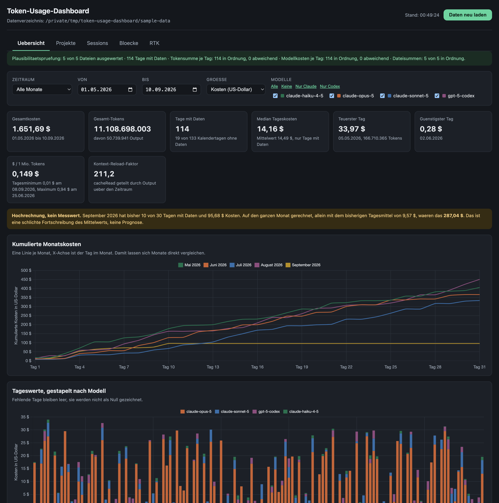

# Token Usage Dashboard (only for macOS)

[](LICENSE)

A local dashboard for Claude Code and Codex usage data: tokens, cost,
projects, sessions and billing blocks, read from a directory of exported
JSON files. Python 3.11+, standard library only, no build step, nothing to
install.

**The user interface supports German and English.** The documentation is in
English. The browser language selects the initial UI language; a selection in
the header is remembered. Numbers and dates follow the selected language,
while costs stay in US dollars.



## Quick start

```bash
git clone https://github.com/Flexible-Universe/Token-Usage-Dashboard.git token-usage-dashboard
cd token-usage-dashboard
python3 tools/make-sample-data.py --out sample-data
python3 app.py
```

The first start writes a `config.toml` next to `app.py`, modelled on
`config.example.toml`. To make the dashboard show the sample data you just
generated, set `directory = "sample-data"` there and start `app.py` again.
Relative paths are resolved relative to `config.toml`, and `~` is expanded.

The sample data is invented. It deliberately carries the cases the dashboard
has to decide about: missing calendar days, uneven coverage across the extra
sources, idle blocks.

## Real operation

The dashboard does not produce data. It needs a directory holding at least
one file matching `YYYY-MM.json`. That directory is filled by the export
chain in [`export/`](export/README.md), which queries `ccusage` and `rtk` and
validates their output before replacing any file. It runs on macOS only.

`install.sh` does the setup:

```bash
./install.sh                     # data directory, export scripts, config.toml
./install.sh --with-launchagents # plus the four nightly launchd runs
./install.sh --dry-run           # shows what would happen, changes nothing
```

The repository is the source of the export scripts, the data directory is
where they run: `install.sh` places them under `<data>/bin`, and the launchd
jobs call those copies. A work in progress therefore cannot drag the nightly
export down with it. If a copy later differs from the repository, the script
reports it and leaves it alone; `--force` brings it up to date.

The full setup — including the manual route — is in
[`docs/07-installation.md`](docs/07-installation.md).

## Configuration

```toml
[data]
directory = "~/Library/Application Support/Claude-Code-Usage"

[server]
host = "127.0.0.1"
port = 8000
open_browser = true
```

Missing keys fall back to the defaults individually. If the data directory
does not exist, or holds no file matching `YYYY-MM.json`, the start aborts
with an error message naming the path that was checked.

## Security

The server has **no authentication**. Anyone who can reach it sees
everything. That is why `host` stays `127.0.0.1` and why the dashboard does
not belong on an open network — neither directly nor behind a tunnel or
reverse proxy without access control of its own. The data contains project
paths, and with them the names of customers, directories and ventures.

## Trademarks

This project is not affiliated with Anthropic or OpenAI, and is neither
endorsed nor reviewed by them. Claude, Claude Code, OpenAI and Codex are
trademarks of their respective owners. `ccusage` and `rtk` are independent
third-party tools; this project merely reads their output.

## License

AGPL-3.0. The full text is in [`LICENSE`](LICENSE), and the running server
serves it at `GET /LICENSE`.

Section 13 implies: anyone who runs this application — modified or not — for
third parties over a network must offer those users the source code of their
version. Anyone running it only for themselves is not affected.

Chart.js 4.4.1 is bundled under `static/vendor/` under the MIT license.

## Layout

| File | Purpose |
|---|---|
| `install.sh` | Sets up data directory, export scripts and launchd runs |
| `app.py` | Entry point, HTTP server, routing |
| `loader.py` | Reading, normalizing, plausibility checks |
| `metrics.py` | Metrics |
| `sources.py` | Reads the extra sources from `projects/`, `blocks/`, `sessions/`, `rtk/` |
| `insights.py` | Metrics for the extra sources |
| `static/` | User interface, plus Chart.js under `static/vendor/` |
| `export/` | Export chain for the data directory, launchd templates under `export/launchd/` |
| `tools/` | `make-sample-data.py` generates sample data to try things out |
| `docs/` | Full documentation, start at [`docs/README.md`](docs/README.md) |
| `tests/` | Tests using `unittest` |

API: `GET /api/data`, `GET /api/metrics`, `GET /api/health`, `GET /api/projects`,
`GET /api/sessions`, `GET /api/blocks`, `GET /api/rtk`. All accept `reload=1`;
all except `/api/data` and `/api/health` also accept `from`, `to` and
`models`. `/api/blocks` and `/api/rtk` ignore `models`: `/api/blocks` because
the source reports no per-model cost, `/api/rtk` because the source knows
nothing about models.

## Tests

```bash
python3 -m unittest discover -s tests -t .
```

Expected: `OK`, currently 229 tests with five skips. Four real-data test
classes are skipped as long as `TOKEN_DASHBOARD_REAL_DATA` does not point at
a real data directory; one installation check is platform-specific.

## Contributing

[`CONTRIBUTING.md`](CONTRIBUTING.md) lists the conventions, which are not up
for negotiation but are carried forward. Security reports: see
[`SECURITY.md`](SECURITY.md). Changes per release: see
[`CHANGELOG.md`](CHANGELOG.md).

## Notes on reading the numbers

- Missing calendar days are gaps, not zeros. Means, medians and the 7-day
  moving average run over days with data only; time series carry `null` on
  missing days.
- `$ / 1 million output tokens` per model is an empirical usage ratio, not a
  list price.
- Models with the prefix `gpt-` are attributed to Codex, all others to
  Claude. The per-day field `agent` (singular) has always been `"all"` so far
  and is no use for this; do not confuse it with the field `agents` (plural)
  mentioned below, which does carry the split.
- The projection for the last, incomplete month extrapolates the daily mean
  and is marked as an estimate in the UI.
- The rtk figures are the proxy's estimates of tokens that were never sent.
  They cannot be offset against the billed tokens of the other sources. They
  come from `rtk/YYYY-MM.json`. This source reaches further back than the
  other extra sources; the actual period is named on the note card in the RTK
  tab.
- Since 01.09.2026 the export additionally writes `projects/YYYY-MM.json`,
  `blocks/YYYY-Www.json` and `sessions/YYYY-Www.json`. These sources feed the
  Projekte, Sessions and Bloecke tabs. For earlier periods those tabs show a
  coverage note instead of empty charts.
- The weekly files do not cover exactly one calendar week. Filtering
  therefore goes by the timestamp inside the record, not by the file name.
- Blocks flagged `isGap` are idle time and count towards no sum or mean.
- The Claude versus Codex split comes from the `agents` field of the monthly
  file from 09/2026 on, and from the model prefix `gpt-` before that.
